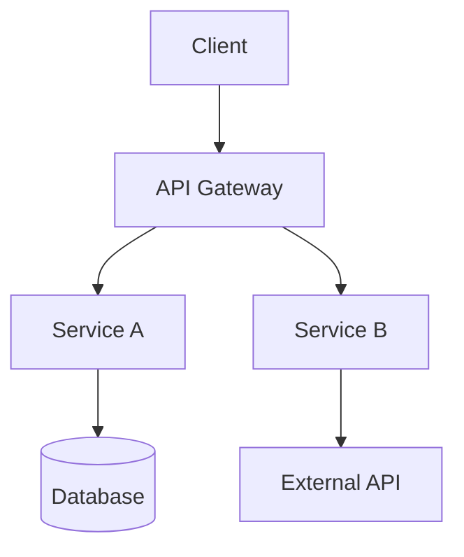
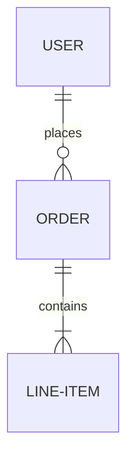

# 📗 TECHNICAL REQUIREMENTS DOCUMENT (TRD): [Project Name]

**Author:** [Name]
**Date:** [YYYY-MM-DD]
**Status:** Draft | In Review | Approved
**Version:** 2.0
**Architecture Type:** Mono-Context
**Agent Executable:** Yes

---

## 1. Document Control
- **Technical Lead:** [Name]
- **Architect:** [Name]
- **Revision History:** [v1.0 - Initial Draft]

---

## 2. System Architecture

### 2.1 Architecture Overview (C4 Model)


### 2.2 Deployment Model
- **Platform:** [AWS / GCP / Azure / On-Prem]
- **Infrastructure:** [Kubernetes / Serverless / EC2]
- **Environment Strategy:** [Dev, Staging, Prod]

### 2.3 ADR (Architectural Decision Records)
| ADR ID | Decision | Status | Rationale |
|--------|----------|--------|-----------|
| ADR-001| [Decision] | [Proposed] | [Why this choice?] |

---

## 3. Micro-Frontend Integration

### 3.1 Module Federation Config
- **Exposes:** `[List of components exposed]`
- **Remotes:** `[List of remote entry points]`

### 3.2 Shared Dependencies
- **Core:** [React v18, GSAP, etc.]
- **Versioning Policy:** [Strict vs. Semantic]

### 3.3 Shell/Container Strategy
- **Composition:** [Runtime / Build-time]
- **State Sharing:** [BroadcastChannel / Custom Events / Store]

---

## 4. API & Interface Specialization

### 4.1 Request/Response Schemas
```typescript
interface SampleRequest {
  id: string;
  payload: object;
}

interface SampleResponse {
  success: boolean;
  data: any;
}
```

### 4.2 Error Handling & Codes
- `ERR_AUTH_001`: Token Expired
- `ERR_VAL_002`: Missing Required Field

### 4.3 Rate Limiting & Gating
- **Public API:** 100 req/min
- **Internal API:** 10,000 req/min

---

## 5. Event-Driven & Messaging

### 5.1 Pub/Sub Topologies
- **Broker:** [Kafka / RabbitMQ / Redis / SNS-SQS]
- **Topic Contracts:** `[topic.name.v1]`

### 5.2 Reliability Patterns
- **Retry Strategy:** [Exponential Backoff (3 retries)]
- **DLQ Handling:** [Manual review vs. Auto-purge]
- **Idempotency:** [X-Idempotency-Key requirement]

---

## 6. Data Persistence & State

### 6.1 ER Diagram (Mermaid)


### 6.2 Indexing & Query Strategy
- **Primary Indexes:** [UUID Partition Keys]
- **Global Secondary Indexes:** [By Email, By Status]

### 6.3 Migration & Seeding
- **Tools:** [Prisma Migrate / Liquibase / Flyway]
- **Strategy:** [Zero-downtime Blue/Green]

---

## 7. Security & Compliance

### 7.1 Threat Modeling
- **Threat:** [SQL Injection] | **Mitigation:** [Parameterized Queries]
- **Threat:** [Cross-Site Scripting] | **Mitigation:** [Content Security Policy]

### 7.2 Auth & Authorization Flows
- **Mechanism:** [OAuth2 / OIDC / JWT]
- **RBAC Policy:** [Admin, Editor, Viewer roles]

### 7.3 Data Protection
- **At Rest:** AES-256
- **In Transit:** TLS 1.3

---

## 8. DevOps & Observability

### 8.1 CI/CD Pipeline Spec
- **Build:** `npm run build`
- **Test:** `npm test`
- **Deploy:** `terraform apply`

### 8.2 Monitoring & Alerting (SLIs/SLOs)
- **Availability:** 99.9% (Uptime)
- **Latency:** < 200ms (P95)
- **Alerting:** P1 Alert on > 1% Error Rate

### 8.3 Logging & Tracing
- **Logging Format:** Structured JSON
- **Tracing:** OpenTelemetry (Distributed IDs)

---

## 9. Agent Instruction Block

### 9.1 Context Scoping
- **Primary Entry Points:** `[Path to main file]`
- **Required Knowledge:** `[Link to coding standards]`

### 9.2 Implementation Constraints
- 🛑 **DO NOT:** Mutate global state directly.
- ✅ **MUST:** Use functional components for all new UI.

### 9.3 Verification Commands
```bash
# Run unit tests
npm run test:unit

# Run contract tests
npm run test:contract

# Build verification
npm run build
```

---

**END OF TRD v2.0**
